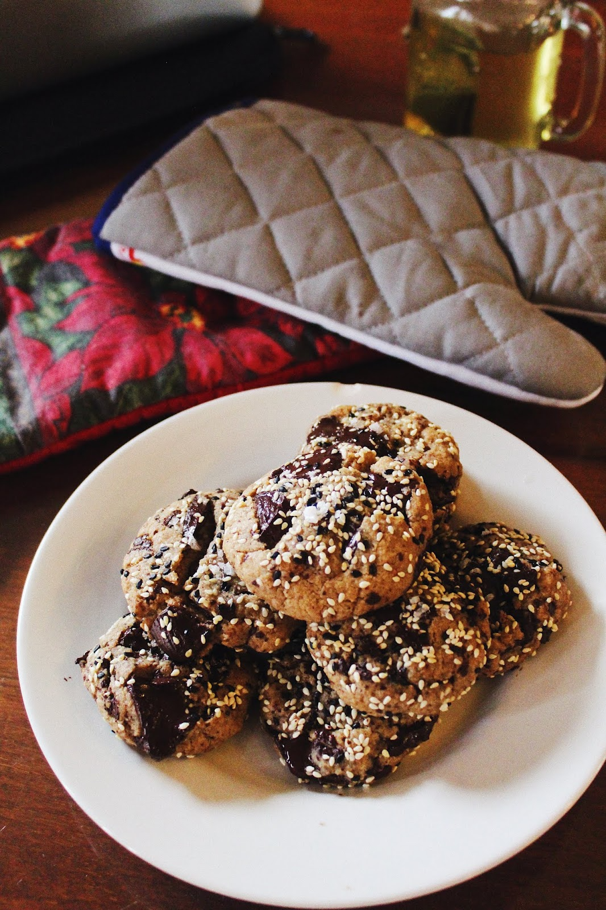
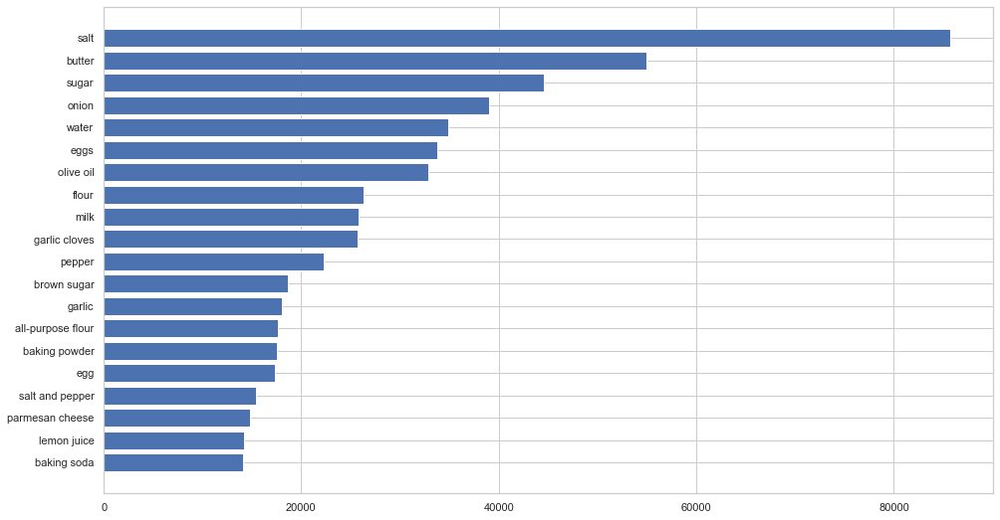
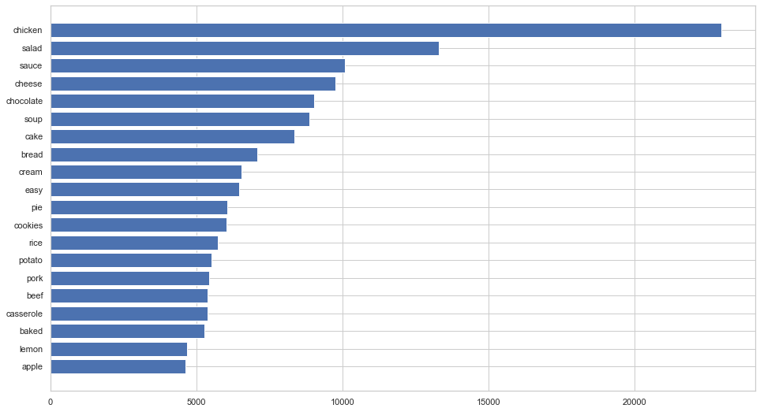
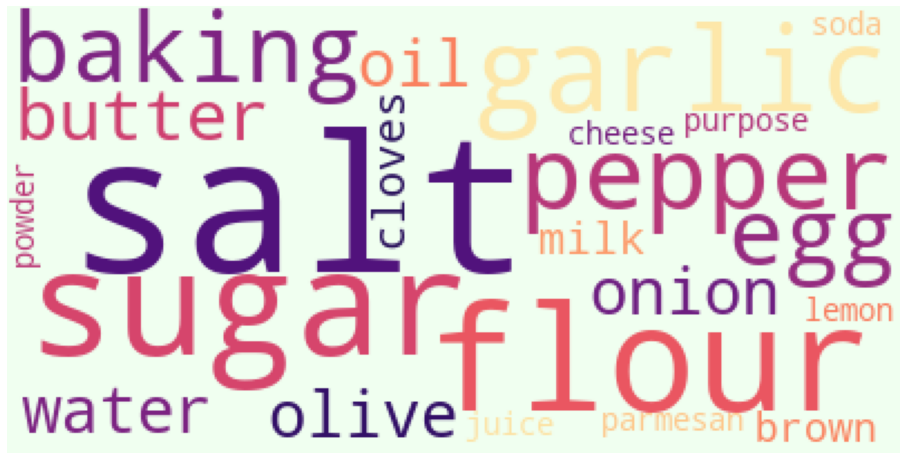
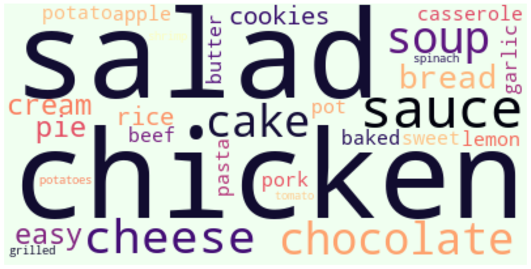

# Recipe Recommendation System

Inspired by my daughter's love for [cooking and baking](https://paintpencilpastries.com/), I decided to build a recipe recommender system to fulfill my graduation requirement from General Assembly.

**Machine Learning Problems**:
1. Can I predict the recipe ratings from user's review?

2. Given certain ingredients, such as things I have in the fridge, could I find some recipes or some suggestions about what to cook?

3. Given a person’s choice one recipe, could I recommend other similar recipes they might enjoy?

4. Can I categorize the recipes? Given a certain recipe, can I find other recipes that fall into the same categories?

The motivation behind this recommendation system is to help users discover personalized and new recipes, or prepare for grocery runs.

# Data

This dataset consists of 230K+ recipes and 1M+ recipe reviews covering 18 years of user interactions and uploads on Food.com (formerly GeniusKitchen). The dataset is collected and stored at [Kaggle.com](https://www.kaggle.com/shuyangli94/food-com-recipes-and-user-interactions?select=RAW_recipes.csv).

**Content Data**

- `RAW_recipes.csv`

- 231,637 Recipes

- Data Columns  

|Feature|Type|Description|
|---|---|-----|
|name|*object*|Recipe name|
|id|*int*|Recipe id|
|minutes|*int*|Minutes to prepare recipe|
|contributor_id|*int*|User ID who submitted this recipe|
|submitted|*object*|Date recipe was submitted|
|tags|*object*|Food.com tags for recipe|
|nutrition|*object*|Nutrition information (calories, total fat, sugar, sodium, protein, saturated fat)|
|n_steps|*int*|Number of steps in recipe|
|steps|*object*|Text for recipe steps, in order|
|description|*object*|User-provided description|

**Content Data**

- `RAW_interactions.csv`
- 1,132,367 users reviews and ratings

- Data Columns  

|Feature|Type|Description|
|---|---|-----|
|user_id|*int*|User ID|
|recipe_id|*int*|Recipe id|
|date|*object*|Date of review/rating|
|rating|*int*|Rating given, range 0 to 5|
|review|*object*|Review text|

# Data Cleaning
Notebook `01_Recipes_Data_Cleaner.ipynb`  
+ Drop recipes with missing or extreme values in raw dataset, then save cleaned data with 191,481 recipes to new csv file `organized_recipes.csv`
+ Drop reviews with missing text and zero ratings in raw dataset, then save cleaned data with 1,071,351 reviews to new csv file `cleaned_reviews.csv`

# Exploratory Data Analysis
Notebook `02_Exploratory_Data_Analysis.ipynb`  

**Top 20 words in ingredients**

 

**Top 20 words in recipe names**

| Recipe ingredient top words                                       | Recipe name top words Stopwords                               |
| ----------------------------------------------------- | ----------------------------------------------- |
|  |  |

# Models

1. Classifications - Use Naive Bayes and Gradient Boost Models to predict ratings from review text--- `03_Ratings_Classifier.ipynb`

> If I found one user wrote in the review  "So simple, so delicious! Great",  the model can predict which rating the user would give.

2. Matching - Use Numpy and Pandas to create search functions which would find recipes with the best ingredient matches. --- `04_Ingredient_match.ipynb`

> If I have winter squash, Mexican seasoning, mixed spice and honey in the fridge, the model can give some recipes on what to cook with these ingredients

3. Collaborative Filtering - Suggest recipes that other users similar to you also liked (Cosine Similarity) --- `05_Item_Collaborative.ipynb` and `05_1_user_collaborative.ipynb`

> If I liked *Oven fried chicken*, and another user similar to me liked *The Texas bbq rub* and I haven't tried it, the model would recommend that recipe.

4. Content Based Filtering - Suggest recipes that are similar to recipes that you like (LDA model similarities) --- `06_LDA_Content_Based.ipynb`

> If I liked *baked winter squash*, the model would recommend *outback croutons*, because the model found some categories that both recipes share.

# Tech Stack

1. **Data Wrangling**: pandas, numpy, re

2. **Visualization**: matplotlib, seaborn

3. **Model:** scikit-learn, scipy, gensim

4. **Web Framework**: flask, html

# Conclusions and Next Steps

1. Model 2, 3 and 4  recommender works well when input query separately on Jupiter notebook.  

2. Need more work to combine the simple search, collaborative filtering and content-based filter together.

3. Web app (Flask) works and return results.  But need more work to improve user interface and shorten the running time.

4. Possible generate new recipe based on user's preference.

# Acknowledgements

1. Elizabeth Ding,  blog https://paintpencilpastries.com/   for  food photos.

2. Shuyang Li,  at [Kaggle.com](https://www.kaggle.com/shuyangli94/food-com-recipes-and-user-interactions?select=RAW_recipes.csv) for food.com dataset.

2. Kelly S. and  Noah C,  private communications.
